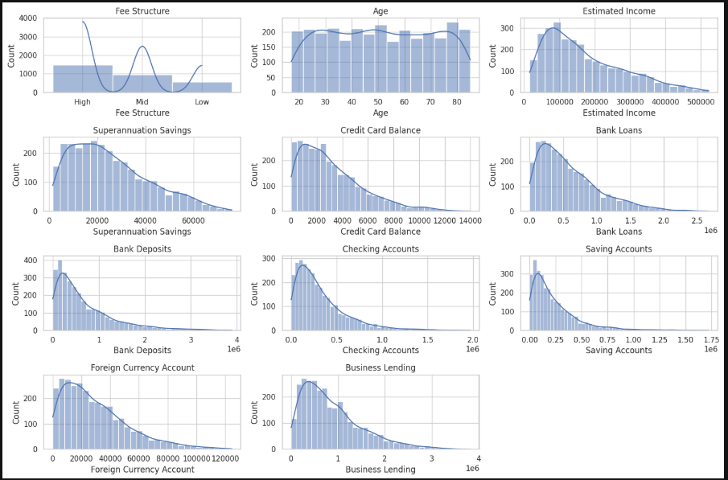
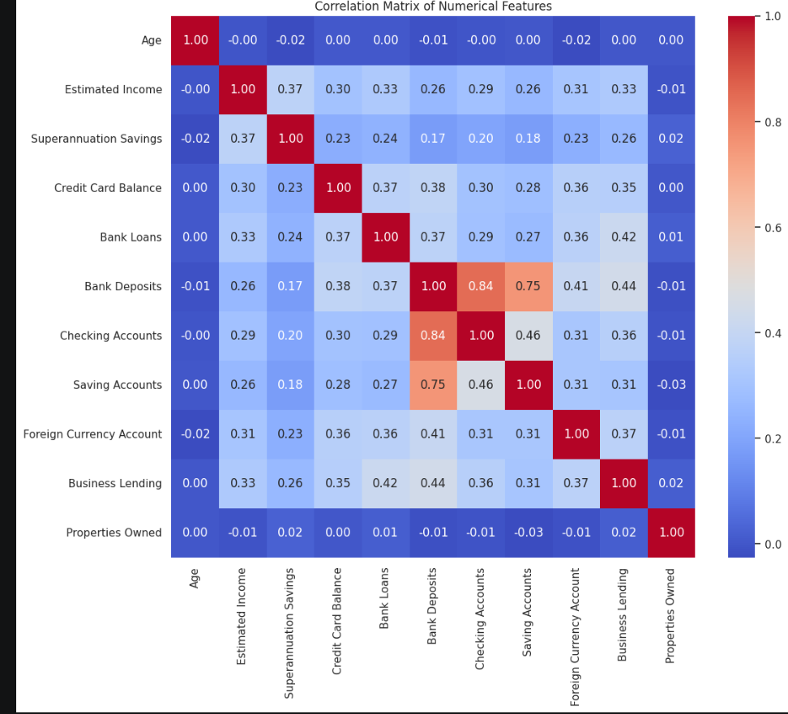
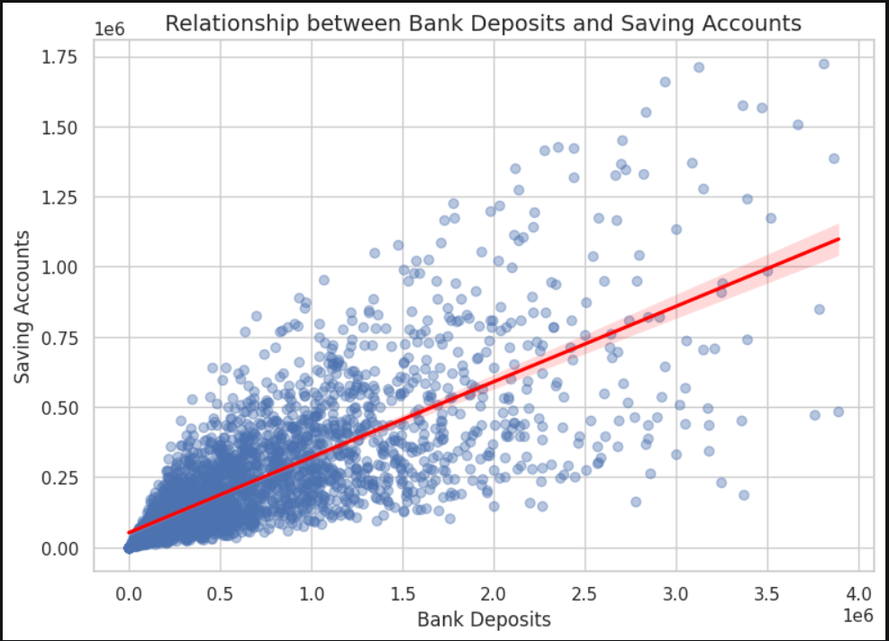
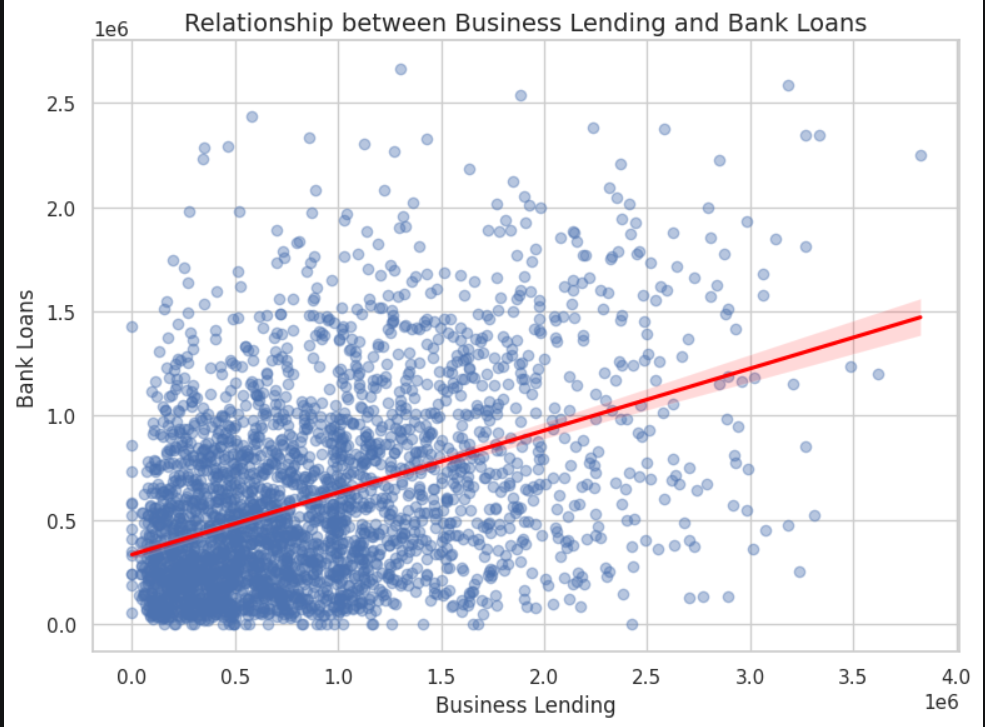

# Bank Customer EDA using Python

## Overview

This project presents an exploratory data analysis of a synthetic bank customer dataset using **Python**.

The workflow begins with loading and understanding the raw dataset using **Pandas**, followed by data quality checks, feature engineering, statistical analysis, and visualization using **Matplotlib** and **Seaborn**.

The project analyzes customer demographics, income groups, account balances, lending behavior, and relationships between financial variables to uncover meaningful banking insights.



---

## Tools & Technologies

- Python
- Pandas
- NumPy
- Matplotlib
- Seaborn
- Jupyter Notebook
- Git
- GitHub
- Data Analysis
- Data Visualization

---

## Key Insights

- Bank Deposits and Saving Accounts showed a strong positive relationship, suggesting customers with higher deposits generally maintain higher savings balances.
- Age and Estimated Income showed moderate relationships with savings and retirement-related accounts.
- Business Lending showed a moderate relationship with Bank Loans, indicating customers may maintain both business and personal borrowing.
- Properties Owned showed weak correlation with banking variables, suggesting external factors influence property ownership.
- Mid-income customers represented the largest customer segment after income classification.

---

# Dataset

The dataset contains synthetic banking information for:

- **3,000 customers**
- **25 attributes**

The dataset includes:

### Customer Demographics

- Age
- Nationality
- Occupation
- Gender
- Location ID

### Banking Information

- Estimated Income
- Bank Deposits
- Checking Accounts
- Saving Accounts
- Credit Card Balance
- Bank Loans
- Business Lending
- Foreign Currency Account
- Superannuation Savings

### Banking Classifications

- Fee Structure
- Loyalty Classification
- Risk Weighting

---

# Data Cleaning & Preparation using Python

The raw dataset was analyzed and prepared using **Python (Pandas)**.

The data preparation process included:

- Loading the dataset
- Checking dataset dimensions
- Inspecting column data types
- Generating descriptive statistics
- Checking missing values
- Converting date columns into appropriate formats

### Dataset Quality Results

- 3,000 records analyzed
- 25 columns available
- No missing values detected

The complete analysis process is available in:

```text
Bank_Customer_EDA.ipynb
```

---

# Feature Engineering

A new feature called **Income Band** was created using the `Estimated Income` column.

Customers were grouped into three categories:

| Income Range | Category |
|---|---|
| Below 100,000 | Low |
| 100,000 - 300,000 | Mid |
| Above 300,000 | High |

This feature helped analyze customer behavior across different income segments.

### Income Band Distribution

- Mid Income: 1,517 customers
- Low Income: 1,027 customers
- High Income: 456 customers

---

# Exploratory Data Analysis

The project explores customer behavior through multiple analysis techniques.

---

## Categorical Analysis

Categorical variables were analyzed to understand customer segments.

The analysis includes:

- Nationality distribution
- Occupation distribution
- Fee Structure analysis
- Loyalty Classification
- Risk Weighting
- Income Band distribution

---

## Numerical Analysis

Financial variables were analyzed using distribution plots.

The analysis covers:

- Estimated Income
- Bank Deposits
- Saving Accounts
- Checking Accounts
- Bank Loans
- Business Lending
- Credit Card Balance
- Superannuation Savings

Visualization techniques used:

- Histograms
- KDE plots

Purpose:

- Understand financial distributions
- Identify skewness
- Analyze customer behavior patterns

---

## Correlation Analysis

A correlation heatmap was created to identify relationships between numerical financial variables.

Important relationships analyzed:

- Bank Deposits vs Saving Accounts
- Age vs Superannuation Savings
- Business Lending vs Bank Loans
- Estimated Income vs Account Balances



---

## Relationship Analysis

Regression plots were used to analyze important financial relationships.

The analysis includes:

- Bank Deposits and Saving Accounts
- Business Lending and Bank Loans
- Age and Superannuation Savings
- Income and Checking Accounts

These relationships helped understand how different financial behaviors interact.

---

# Results

## Income Distribution Analysis

The income distribution was analyzed to understand customer earning patterns and identify customer segments.


---

## Correlation Analysis

The correlation matrix highlights relationships between customer financial variables.


---

## Bank Deposits vs Saving Accounts

Customers with higher deposits generally maintained higher saving account balances.

This relationship indicates strong customer saving behavior and potential opportunities for targeted banking products.



---

## Business Lending vs Bank Loans

The relationship between business lending and personal loans was analyzed to understand customer borrowing patterns.



---

# Project Structure

```text
Bank_Customer_EDA/
│
├── Banking.csv
├── Bank_Customer_EDA.ipynb
│
├── screenshots/
│   ├── income_distribution.png
│   ├── correlation_heatmap.png
│   ├── deposits_vs_savings.png
│   └── lending_relationship.png
│
├── requirements.txt
└── README.md
```

---

# Skills Demonstrated

Through this project, I gained practical experience in:

- Data Cleaning using Python (Pandas)
- Exploratory Data Analysis
- Feature Engineering
- Statistical Analysis
- Data Visualization
- Correlation Analysis
- Customer Segmentation
- Business Insight Generation
- Git and GitHub for project version control

---

# Future Improvements

Possible enhancements for this project include:

- Building a customer risk prediction model
- Performing customer segmentation using clustering algorithms
- Creating interactive dashboards using Power BI or Tableau
- Developing machine learning models for credit risk classification
- Deploying the analysis using Streamlit

---

# Author

**Eshika Das**

If you have any feedback or suggestions, feel free to connect with me.